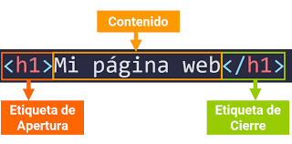
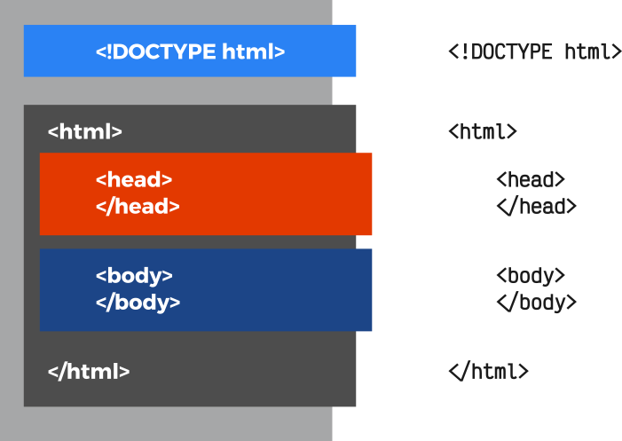

# HTML/CSS

## Introducción a HTML

HTML significa en inglés HyperText Markup Language, y en español es Lenguaje de Marcado de Hipertexto. Es un lenguaje que nos permite definir la estructura de una página web y sus contenidos el cual verá el usuario. Por ejemplo, sus contenidos podrían ser párrafos, una lista con viñetas, o imágenes y tablas de datos.

### ¿Qué es un elemento?

Un elemento es un componente básico de un archivo HTML, y usamos los elementos para definir la estructura de una página web en un archivo html.


```html
<element>
  ...
</element>
```



Algunos elementos no necesitan etiquetas de cierre.

```html

```

### Etiquetas

Las etiquetas nos permiten definir los elementos en un archivo HTML, es decir, las etiquetas HTML son fragmentos de código que permiten especificar el tipo de elemento que se va a crear.
El formato de una etiqueta HTML es un bloque de texto encerrado entre corchetes angulares < >, y cada elemento HTML tiene una etiqueta de inicio \<etiqueta> y termina con una etiqueta de cierre que lleva una barra inclinada \</etiqueta>

```html

```

### Atributos

El Atributo
En algunas etiquetas HTML, existen algunos atributos específicos (que pueden ser opcionales u obligatorios). Los atributos determinan cierta información sobre la etiqueta (o su modo de actuar) y generalmente van asociados a un valor determinado. Este par atributo-valor se escribe después del nombre de la etiqueta, separándola por espacio y antes del carácter > de la etiqueta de apertura:

### Comentarios

Los comentarios son una práctica muy común y habitual en los desarrolladores o programadores. Se basa en introducir breves fragmentos de texto que el navegador ignora y no tendrá en cuenta a la hora de crear la página visualmente, pero que a nosotros nos sirven de ayuda para documentar algún detalle, explicar algo importante o simplemente introducir algún texto que consideramos relevante:

```html
<!-- Esto es un comentario de ejemplo que el navegador ignorará -->
```

### Atributos Comunes

`id` ->	nombre ->	Establece un identificador a la etiqueta HTML (sólo una por página con ese nombre).

`class`	-> nombre	-> Establece una clase (género) a una etiqueta HTML. Puede repetirse por página.

`lang`	-> idioma ->	Indica el idioma del contenido de la etiqueta HTML.
translate	yes | no	Indica si el contenido de la etiqueta es traducible o no.

`title`	> título	-> Mensaje mostrado en un tooltip (aviso amarillo emergente) al mover el ratón encima.

`data-*` ->	nombre ->	Metadatos en la propia etiqueta. Se puede usar cualquier nombre con prefijo data-.

`accesskey`	-> atajo ->	Combinación de teclas que puede pulsar el usuario para activar el elemento.

`dir` ->	ltr | rtl ->	Establece la direccionalidad del texto (left to right o right to left).

`style`	-> estilos	Aplica propiedades CSS directamente al elemento en cuestión.

## Estructura

Un documento HTML debe tener siempre una estructura inicial, con algunas etiquetas y características obligatorias y otras recomendables. Ese esquema es el siguiente, donde se diferencian tres zonas principales:

- Tipo de documento: En la primera línea del documento HTML debe ir especificado siempre de que tipo de documento HTML se trata. No es absolutamente obligatorio indicarlo (de hecho, hay páginas webs que no lo tienen), pero eso trae algunas consecuencias que veremos más adelante.

- Head: En el documento HTML hay una primera sección donde se especificarán todos los metadatos del documento, es decir, la parte «que no se ve» directamente en el navegador de forma visual.

- Body: La segunda sección es el cuerpo de la página, donde si aparecen todos los elementos que aparecerán visualmente en el navegador del usuario.

Las dos últimas secciones deben estar dentro de la etiqueta \<html>, que es la que debe contener cualquier tipo de etiqueta HTML (salvo el tipo de documento, que debe especificarse antes):



## Etiquetas de Texto

### Fragmentos de texto

En primer lugar, existe una serie de etiquetas HTML simples para seleccionar un fragmento de texto y dotarlo de un significado especial. Por ejemplo:

- `<strong>` ->	Fragmento de texto importante o palabras clave.
- `<em>`	-> Fragmento de texto enfatizado respecto a la frase que lo contiene.
- `<mark>` ->	Fragmento de texto resaltado, simulando estar marcado con rotulador amarillo.
- `<i>`	-> Fragmento de texto con voz o tono alternativo al resto.
- `<b>`	-> Fragmento de texto sin importancia destacable (fines utilitarios).
- `<u>`	-> Fragmento de texto para nombres propios o escritura incorrecta intencionada (sic).
- `<s>`	-> Fragmento de texto inexacto o que ya no es relevante. (errores o inexactitudes)
- `<span>`	-> Fragmento de texto sin significado (útil para seleccionar).
- `<cite>` -> Fragmento de texto con el título de un trabajo creativo: obras, libros...

### Modificación de significado

Con las siguientes etiquetas HTML también podemos modificar el significado de la información que contienen:

- `<sup>`	->	Superíndice (242).
- `<sub>`	->	Subíndice (242).
- `<small>`	->	Anotaciones menores pequeñas puntualizaciones.
- `<q>`	-> cite ->	Cita o frase extraída de otro contexto.
- `<dfn>`	-> title	-> Definición (término que posteriormente será definido).
- `<abbr> `-> title	-> Abreviatura o acrónimo.


Los saltos de línea son etiquetas especiales de HTML para comenzar en una línea nueva (emular el efecto al pulsar ENTER). Al contrario que todas las que hemos visto, las etiquetas \<br> son etiquetas que no necesitan etiqueta de cierre, por lo que sólo se escribe la etiqueta de apertura.

- `<br>` ->	Salto de línea (nueva línea).
- `<wbr>`	-> Oportunidad de salto de línea (división silábica con guión).

### Aspectos informáticos

Existen una serie de etiquetas HTML ligeramente orientadas a aspectos informáticos como combinaciones de teclado del usuario o para representar variables matemáticas o informáticas:

- `<kbd>`	->	Entrada de información del usuario (generalmente, combinación de teclado).
- `<samp>`	->	Salida de información de un programa informático.
- `<var>`	->	Variable (contexto matemático o informático).
- `<time>` ->	datetime ->	Indica una fecha/hora legible para humanos, con formato para máquinas opcional.
- `<data>`	-> value ->	Información equivalente orientado a máquinas.
- `<code>`	->	Fragmento de código fuente (en línea).

## Etiquetas de Agrupación

### Agrupaciones

Las siguientes etiquetas se utilizan para agrupar información, como es el caso de las etiquetas `<div>` o `<p>` que vimos en el ejemplo mostrado anteriormente:

- `<div>`	->	Capa o división utilizado para agrupar varias etiquetas HTML.
- `<p>`	-> Define un párrafo de texto (con sus etiquetas HTML para texto).
- `<pre>`	-> Establece un texto preformateado (respetando espacios y saltos de línea).
- `<blockquote>` -> cite	Agrupa información y características de una cita (autor, fuente, etc...).
- `<main>`	-> Contenedor para englobar la parte principal de la página.
- `<hr>`	-> Indica una separación temática del texto.

### Listas
En HTML podemos crear listas de información de una forma muy sencilla. Empecemos por las etiquetas disponibles:

- `<ul>`		-> Define una lista sin orden. Se trata de la etiqueta contenedora.
- `<ol>` ->	start, reversed, type	Define una lista numerada (con orden). Etiqueta contenedora.
- `<li>` ->	value	Define un ítem de la lista.

### Listas de descripciones

- `<dl>` ->	Define una lista de descripciones. Es la etiqueta contenedora.
- `<dt>` ->	Término de la descripción. Contiene el nombre o término a describir.
- `<dd>` ->	Descripción o valor asociado al término. Pueden existir varios por término.

### Ilustraciones (figuras)
Por último, dentro del apartado de etiquetas de agrupación tenemos las nuevas etiquetas `<figure>` y `<figcaption>`. Estas etiquetas se utilizan para agrupar conceptos formados por una ilustración (figura) y una leyenda. Con estos elementos de agrupación se puede agrupar una imagen y su correspondiente pie de foto, pudiendo ampliar a otro tipo de contenidos multimedia como video o audio.

- `<figure>`	-> Establece una figura, que puede contener una serie de elementos diversos.
- `<figcaption>` -> Asocia una leyenda, generalmente texto, a la figura anterior. Opcional.

## Enlaces, vínculos o hipervínculos

- `<a>` ->	Etiqueta para hacer referencia a otras páginas web o recursos como documentos o archivos

Esta etiqueta debe tener, como mínimo, el atributo href, ya que es el atributo con el que se especifica la dirección URL al documento que se quiere enlazar. Aún así, la etiqueta \<a> también tiene varios atributos opcionales, veamos un resumen de todos ellos:

- `href`	-> URL	-> Enlace al documento que se quiere cargar. Atributo obligatorio.
- `download` ->	nombre.ext	-> Descarga el enlace (href) en lugar de abrirlo. Si se indica valor, se renombra.
- `target`
- - `_blank` ->	Abre el enlace en una nueva pestaña.
- - `_self` ->	Abre el enlace en la pestaña o \<iframe> actual.
- - `_parent` ->	Abre el enlace en el documento padre.
- - `_top` ->	Abre el enlace en el documento raíz (padre global).
- - `nombre` ->	Abre el enlace en el \<iframe> con el nombre especificado.
- `rel`	
- - `alternate`	-> Indica que el enlace es una versión alternativa (idioma o formato diferente).
- - `author`	-> Indica que el enlace es la web del autor de la página actual.
- - `bookmark` ->	El enlace es un permalink a la sección de la página actual.
- - `help`	-> Indica que el enlace ofrece ayuda para la página actual.
license	Indica que la página actual está cubierta por la licencia referenciada.
- - `prev`	-> Indica que el enlace es la parte previa del documento actual.
- - `next`	-> Indica que el enlace es la parte siguiente del documento actual.
- - `nofollow` ->	Indica que el enlace no está supervisado por el autor del sitio web.
- - `noreferrer` ->	El navegador no envía la página de procedencia al visitar el enlace.
- - `prefetch`	-> El navegador precarga el enlace (es probable que se haga clic)
- - `search` ->	Indica que el enlace es una página para realizar búsquedas.
- - `tag` ->	Asocia una etiqueta al enlace especificado, en relación al documento actual.
- `hreflang`	-> Idioma ->	Código ISO 639-1 del idioma del documento.
- `type` ->	Tipo ->	Tipo de contenido MIME al que se enlaza. Atributo no obligatorio.

## Etiquetas de Sección

En versiones anteriores a HTML5, al crear la estructura de una página, normalmente utilizabamos etiquetas \<div> para ir agrupando secciones de la página. Unido a esto, ibamos añadiendo id o clases (atributos) dependiendo de nuestro interés, para que quedase más claro. 

En HTML5 se introducen una serie de etiquetas de agrupación que funcionan exactamente como un \<div>, pero que además tienen un significado semántico porque indican la naturaleza del contenido que agruparán.

### Etiquetas semánticas

- `<article>` ->	Artículo. Parte principal de un escrito (posts, mensaje en foros, comentario...)
- `<nav>` ->	Apartado de navegación (enlaces de secciones, categorías, etc...)
- `<header>` ->	Cabecera visual de la página (logotipo, título, etc...). No confundir con <head>.
- `<h1>` ->	Encabezado de nivel 1. Equivalente al título del documento.
- `<h2>` ->	Encabezado de nivel 2. Equivalente al tema del documento.
- `<h3>` ->	Encabezado de nivel 3. Equivalente a la sección de un tema.
- `<h4>`	-> Encabezado de nivel 4. Equivalente a un apartado de la sección.
- `<h5>`	-> Encabezado de nivel 5. Equivalente a un ejemplo del apartado.
- `<h6>` ->	Encabezado de nivel 6. Equivalente a un subapartado del ejemplo.
- `<footer>`	-> Pie de página de una sección (o del documento completo).
- `<section>`	-> Sección o grupo temático de contenido. No usar sólo para dar estilo.
- `<aside>`	-> Agrupación de contenido no relacionado con el tema principal del documento.
- `<address>`	-> Agrupación con la información de contacto del autor del artículo o documento.

## Etiquetas de Tablas

### Tablas básicas

Una tabla puede ser sencilla o compleja, dependiendo de nuestro objetivo y la cantidad de etiquetas o atributos a utilizar. Así pues, veamos primero las etiquetas básicas para crear una tabla de la forma más sencilla posible:

- `<table>` -> 	Etiqueta contenedora que tendrá en su interior toda la tabla.
- `<tr>` ->	Table Row. Etiqueta contenedora de cada fila de la tabla.
- `<td>` ->	Table Data. Cada una de las celdas de la tabla.
- `<th>` ->	Table Header. Cada una de las celdas de cabecera de la tabla.

La etiqueta `<table>` sería el elemento que contendría todos los elementos de la tabla, mientras que `<th>` y `<td>` se utilizarían para cada uno de los campos de la tabla (cabecera y celda respectivamente). Cada vez que se quisiera añadir una nueva fila, habría que incluirlo todo dentro de una etiqueta `<tr>`.

### Combinar celdas

Cada etiqueta `<td>` y `<th>` puede incluir una serie de atributos para modificar su comportamiento o para establecer relaciones semánticas entre celdas. Probablemente, las más interesantes sean colspan y rowspan:

- `colspan` ->	número	-> Número de columnas que la celda abarcará.
- `rowspan`	-> número	-> Número de filas que la celda abarcará.
- `headers`	-> ids	-> Id de los elementos `<th>` con los que tiene relación la celda.
- `scope` (solo `<th>`)
- - `row` ->	La cabecera se aplica a alguna de las filas adyacentes.
- - `col`	-> La cabecera se aplica a alguna de las columnas adyacentes.
- - `rowgroup`	-> La cabecera se aplica a todas las celdas restantes de la fila.
- - `colgroup`	-> La cabecera se aplica a todas las celdas restantes de la columna.
- - `auto`	-> La cabecera se aplica a las celdas de forma automática.
- `abbr` (solo `<th>`)	-> nombre ->	Abreviatura o información alternativa sobre la cabecera.

Con estos atributos podemos indicar que ciertas celdas abarquen más espacio y se combinen con el espacio que ocuparía otra celda adyacente y así crear estructuras de tabla más flexibles.

### Organización de tablas

Por defecto, al crear una tabla, el navegador se encarga de crearla a medida que va leyendo las etiquetas, por lo que la tabla se crea en el orden que se han especificado sus elementos, de arriba a abajo. Sin embargo, podemos utilizar una serie de etiquetas contenedoras que establecerán la zona de la tabla donde deben aparecer su contenido:

- `<thead>` ->	Etiqueta contenedora de la cabecera de la tabla. Parte superior de la tabla.
- `<tbody>` ->	Etiqueta contenedora del cuerpo de la tabla. Parte central de la tabla.
- `<tfoot>` ->	Etiqueta contenedora del pie de la tabla. Parte inferior de la tabla.
- `<caption>` ->	Establece un título de la tabla, independientemente de su posición.

A las etiquetas de tabla ya vistas, podemos añadir estas etiquetas, pudiendo definir la zona donde aparecerán sin que, necesariamente tengan el orden correcto.

### Agrupación de columnas 

Las tablas, al definirse en el código siguiendo una estructura horizontal, hacen complejo el aplicar o realizar una serie de cambios a una columna. Existe una serie de etiquetas para agrupar o seleccionar columnas y así poder realizar tareas sobre ellas, como por ejemplo, asociarle una clase específica o darle estilos CSS a una columna concreta de la tabla, sin necesidad de ir celda por celda.

Para ello, utilizaremos las dos siguientes etiquetas:

- `<colgroup>` ->	Etiqueta contenedora de columnas. Crea una agrupación de columnas.
- `<col>` ->	Etiqueta que representa a una columna de la tabla.

Estas etiquetas pueden tener especificado un atributo llamado span para así aplicar los atributos de la etiqueta `<col>` al número de columnas adyacentes que se indiquen en dicho atributo.

## Etiquetas de imágenes

Para incluir imágenes en el contenido de una página utilizaremos la etiqueta ``, que es una etiqueta muy sencilla, que dispone de varios atributos para modificar como se verá la imagen (los atributos src y alt son siempre obligatorios):


- `src`	-> Indica el nombre o la URL de la imagen a mostrar. Atributo obligatorio.
- `alt`	-> Establece un texto alternativo que describa la imagen a mostrar. Atributo obligatorio.
- `width` ->	Indica el ancho de la imagen en píxels (sin la unidad). Se puede hacer desde CSS.
- `height`	> Indica el alto de la imagen en píxels (sin la unidad). Se puede hacer desde CSS.

### Nuevas etiquetas de imágenes

HTML 5.1 incorporó un nuevo sistema para utilizar imágenes en nuestros documentos HTML de forma mucho más flexible que la antigua etiqueta `` que nos permitirá mostrar imágenes dependiendo de nuestras necesidades. Para ello, utilizaremos las dos siguientes etiquetas:

- `<picture>`	->	Agrupa una serie de imágenes. Etiqueta contenedora.
- `<source>`	-> srcset, sizes, media, type ->	Mostrará la imagen que cumpla una serie de criterios opcionales.

Como podemos ver, lo interesante está en la etiqueta `<source>`, que tiene una serie de atributos disponibles para utilizar. Vamos a ver para que sirve cada uno:

El tag `<html>` va a contener a todos los demás tags dentro suyo. Este tag básicamente sirve para avisarle al browser que el contenido debe ser interpretado como `html`.

- `srcset` ->	Serie de imágenes (separadas por coma) que se utilizarán. Atributo obligatorio.
- `sizes`	-> Tamaño específico de la imagen que finalmente se mostrará.
- `media`	-> Condición que se debe cumplir para que muestre la imagen. Ver media queries.
- `type`	-> Tipo de formato de imagen. Opcional.

## Etiquetas de Video

En HTML5 se introduce la interesante posibilidad de mostrar videos directamente desde nuestro navegador. De hecho, si arrastramos un video a la ventana del navegador, veremos que comienza a reproducirse en él. Para poder insertar videos en nuestras páginas HTML tenemos que utilizar la etiqueta `<video>`, que junto a la etiqueta `<source>` podremos utilizar estas capacidades multimedia de HTML5.

### Video (modo básico)

La etiqueta `<video>` tiene varios atributos a nuestra disposición:

- `src`	-> Dirección URL	-> Video a reproducir. Obligatoria si actua como etiqueta contenedora.
- `poster`	-> Dirección URL	-> Muestra una imagen a modo de presentación.
- `preload`	-> auto | metadata | none ->	Indica como realizar la precarga del video.
- `mediagroup`	-> nombre ->	Establece un nombre para un grupo de contenidos multimedia.
- `autoplay`	-> Boolean ->	Comienza a reproducir el video automáticamente.
- `loop`	-> Boolean ->	Vuelve a iniciar el video cuando finaliza su reproducción (bucle).
- `muted`	->	Boolean ->	Establece el video sin sonido (silenciado).
- `controls`	->	Boolean ->	Muestra los controles de reproducción. Por defecto no se muestran.
- `width`	-> tamaño	Indica el tamaño de ancho del video.
- `height`	-> tamaño	Indica el tamaño de alto del video.

### Video (modo avanzado)

- `<source>`	-> src, type	-> Establece un archivo de video o lo añade como alternativa.
- `<track>`	-> src, srclang, label, kind, default	-> Establece un archivo de subtítulos o lo añade como alternativa.

## Etiquetas de Audio

Al igual que vimos en el tema anterior con los videos, es posible añadir archivos de audio a nuestras páginas web para colocar música, sonidos o simplemente usar música como ambientación. En versiones anteriores de HTML se usaba una etiqueta HTML obsoleta denominada `<bgsound>` que realizaba algo similar.

En este caso, utilizaremos la etiqueta `<audio>` que funciona exactamente igual que `<video>`, pero con relación a archivos de audio.

### Audio (modo básico) 

La etiqueta `<audio>` tiene varios atributos a nuestra disposición:

- `src`	-> Dirección URL	-> Audio a reproducir. Obligatoria si actua como etiqueta contenedora.
- `preload`	-> auto | metadata | none ->	Indica como realizar la precarga del audio.
- `mediagroup`	-> nombre	-> Establece un nombre para un grupo de contenidos multimedia.
- `autoplay`	->	Boolean -> Comienza a reproducir el audio automáticamente.
- `loop`	-> Boolean -> Vuelve a iniciar el audio cuando finaliza su reproducción (bucle).
- `muted`	-> Boolean -> Establece el audio sin sonido (silenciado).
- `controls`	->	Boolean -> Muestra los controles de reproducción. Por defecto no se muestran.

### Audio (modo avanzado)

La etiqueta `<audio>` también puede actuar como etiqueta contenedora e incluir varias etiquetas HTML para dotar de mayor compatibilidad, o capacidades adicionales.

- `<source>` ->	src, type	Establece un archivo de audio o lo añade como alternativa.
- `<track>` ->	src, srclang, label, kind, default	Establece un archivo de subtítulos o lo añade como alternativa.

## Etiquetas de relación

Existen varias etiquetas que se suelen utilizar en esta sección de cabecera del documento:

- `<title>`	->	Título de la página (pestaña o título del navegador o en buscadores).
- `<base>` ->	href, target	-> URL base del documento (usado para gestionar rutas relativas).
- `<link>` ->	href, hreflang, rel, media, type	-> Establece una relación del documento actual con otro externo.
- `<meta>` ->	name, content, http-equiv, charset	-> Establece un metadato específico en el documento actual.
- `<style>`	-> media, type ->	Crea estilos CSS que afectarán únicamente al documento actual.
- `<script>`	-> src, type, charset, async, defer	-> Indica un script a cargar o ejecutar en la página actual.

Existe dos etiquetas que tradicionalmente solían incluirse en la cabecera de un documento HTML. Sin embargo, actualmente también pueden utilizarse en el cuerpo de la página. Hablamos de las etiquetas `<style>` y `<script>`.

La etiqueta `<style>` sirve para incluir estilos CSS en la propia página HTML.
La etiqueta `<script>` sirve para incluir código Javascript en la propia página HTML (o de forma externa), pero tiene una explicación mucho más extensa y la retomaremos más adelante.

## Etiquetas de metadatos

Quizás, la etiqueta con mayor número de posibilidades en la cabecera de un documento HTML es la etiqueta `<meta>`. En ella, y a través de los atributos name y content podemos indicar una gran cantidad de metadatos al documento. Veamos los más conocidos:

- `description`	-> texto	-> Indica la descripción de la página que aparece en buscadores.
- `keywords`	-> palabras clave	-> Lista de palabras clave separadas por comas. Google no la tiene en cuenta.
- `author`	-> nombre	Indica el nombre del autor de la página.
- `language`	-> idioma	-> Código ISO 639-1 del idioma del documento HTML.
- `generator`	-> software	-> Indica el software utilizado para crear la página web.
- `theme-color`	-> color	-> Color en formato hexadecimal de la barra de navegación del navegador.
- `viewport`	-> parámetros	-> Comportamiento de la región visible del navegador. Ver Responsive.


## Recursos adicionales

* [MDN official CSS documentation](https://developer.mozilla.org/es/docs/Learn/CSS/First_steps/How_CSS_works)
* [MDN official HTML documentation](https://developer.mozilla.org/es/docs/Web/HTML)
* [w3schools: The Box Model](hhttps://www.w3schools.com/css/css_boxmodel.asp)


<br>
<br>

<table class="hide" width="100%" style='table-layout:fixed;'>
  <tr>
    <td>
      
      <br>
      <a href="https://forms.gle/MY9PJuXbMnD17e548">
        Has click acá para dejar tu feedback sobre esta clase.
      </a>
    </td>
  </tr>
</table>

---

#### Si tienes dudas sobre este tema, puedes consultarlas en el canal **_Preguntas_** de Discord