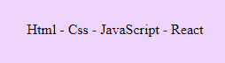
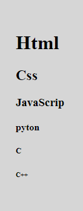
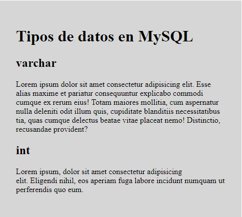
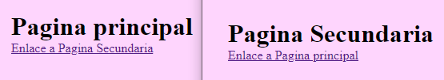
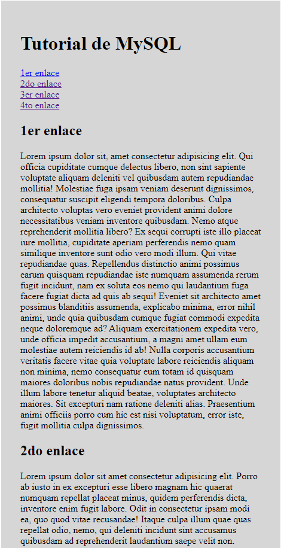
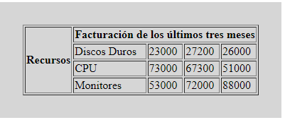

 
 

# Desafío: Html

## Instrucciones

### Ejercicio I

Crear un nuevo archivo dentro de la carpeta `Desafío` llamado `desafio.html` donde deberás realizar lo siguiente:

I. Cree una página HTML básica el cual contenga 2 divisiones:

- En la primera division cree un parrafo que muestre 4 o 5 nombres de lenguajes de programación, separados por un guión.

`Resultado`

- En la segunda division cree titulos de 5 nombres de lenguajes de programación, partiendo desde el titulo de primer nivel \<h1> hasta el ultimo nivel \<h6>.

`Resultado`

II. Cree una página que contenga un título de primer nivel \<h1> y luego dos títulos de nivel \<h2>. Definir un párrafo lorem para cada título de segundo nivel. 

`Resultado`

III. Cree una página principal que tenga un enlace a otra página secundaria. La página secundaria debe tener también un enlace a la página principal. 

`Resultado`

IV. Cree una página que contenga cuatro enlaces ancla, luego definir cuatro enlaces las cuales se enlacen con dichas anclas. 

`Resultado`

### Ejercicio II

I. Crea una página web haciendo uso de enlaces internos de forma que
tengamos un menú con dos opciones LarnU y Proyectos. Desde estas opciones podemos movernos a la parte inferior de la pagina donde añadiremos un título y dos párrafos a LarnU y otro título y dos párrafos para Proyectos.

Nota: escribe nombres claros para las anclas y para rellenar los textos usa lorem ipsum.

II. Una empresa de pizzas tiene 3 ofertas del dia. Las cuales son ( 1ra promoción - 1 mozzarella + una bebida que cuesta 5 dolares, 2da promoción - 2 mozzarellas a 6 dolares y 3ra promoción - 4 mozarrellas a 10 dolares).

Crea una página que disponga tres enlaces a cada una de esas ofertas.
Al ser presionadas abrir, el cliente podrá abrir su correo para poder enviar la promoción elegida. En el título indicar si se trata de la promoción 1, 2 o 3.

III. Crea una tabla el cual muestre la facturación de los últimos tres meses de los artículos de una tienda de electrodomesticos:'Discos Duros', 'CPU' y 'Monitores'. La primer columna debe mostrar solo el texto 'Recursos' y en la primer fila el texto 'Facturación de los últimos tres meses'. 

`Resultado`

