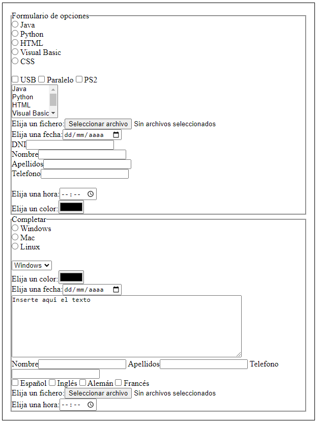

 
 

# Desafío: Html_Formulario

## Instrucciones

### Ejercicio I

Recrea los siguientes formularios utilizando adecuadamente las etiquetas

I. `Resultado`

II. `Resultado`

III. `Resultado`

IV. `Resultado`

